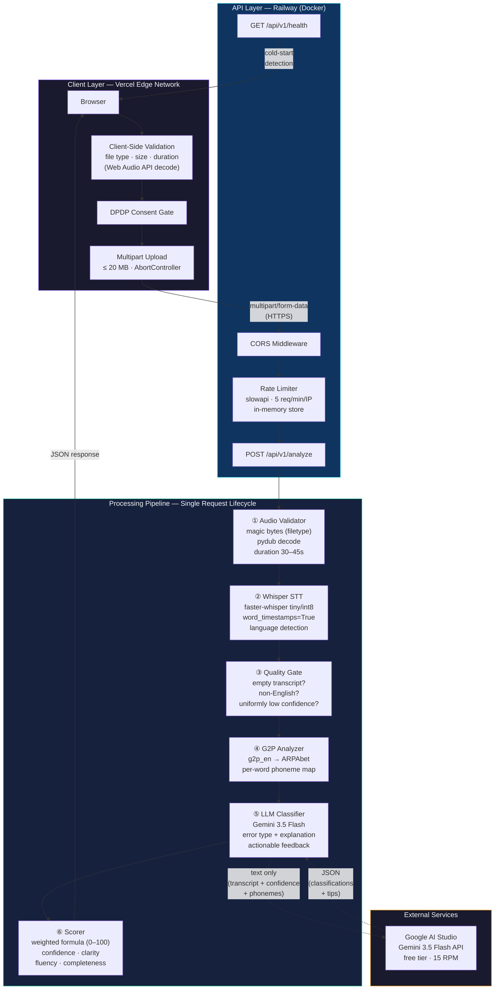
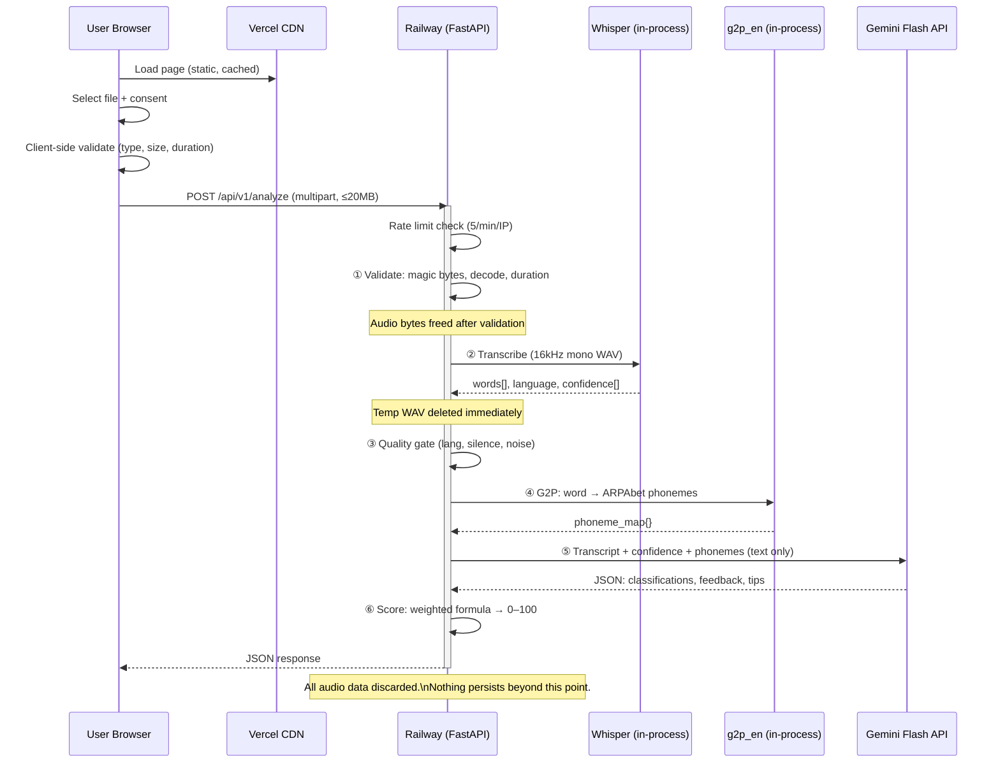

# PronounceAI — Architecture Document

> **English Pronunciation Scoring System**
> Free-form speech analysis using Whisper STT, G2P phoneme comparison, and LLM-powered error classification.
>
> **Live:** [pronounceai-app.vercel.app](https://pronounceai-app.vercel.app) · **Source:** [github.com/impiyushkumar/PronounceAI](https://github.com/impiyushkumar/PronounceAI) · Piyush Kumar · July 2026

---

## 1. System Overview



### Request Lifecycle (Sequence)



---

## 2. Technology Choices & Reasoning

| Component | Choice | Why This — Not That |
|-----------|--------|---------------------|
| **STT Engine** | `faster-whisper` (tiny, int8, CPU) | OpenAI's Whisper API doesn't expose per-word `probability` scores — only timestamps. We need `word.probability` (0.0–1.0) as the primary signal for pronunciation quality. `faster-whisper` uses CTranslate2 under the hood: **4× faster** and **~50% less RAM** than vanilla Whisper. The `tiny` model at int8 quantization fits in ~300MB RAM. |
| **G2P** | `g2p_en` v2.1 | Pure NumPy (no TensorFlow/PyTorch), handles homograph disambiguation via POS tagging ("I *refuse* to collect the *refuse*"), outputs ARPAbet phonemes from the CMU Pronouncing Dictionary with a neural fallback for OOV words. Alternatives like `phonemizer` require a system-level `espeak-ng` install, adding deployment complexity for marginal benefit. |
| **LLM** | Gemini 3.5 Flash (Google AI Studio) | Free tier provides ~15 RPM / ~500 RPD — sufficient for a portfolio demo. Fast inference (~1-2s). The LLM receives **only text** (transcript + confidence scores + phoneme data), never raw audio — important for DPDP. Claude was considered but Gemini's free tier is more generous for this use case. |
| **Backend** | FastAPI (Python 3.11) | Async request handling, native `UploadFile` support, Pydantic validation for request/response models, auto-generated OpenAPI docs at `/docs`. Python is required because `faster-whisper` and `g2p_en` are Python-native. |
| **Frontend** | Next.js 14 + TypeScript | App Router with React Server Components, static generation for the upload page (zero-JS initial paint for SEO), trivial Vercel deployment. TypeScript interfaces mirror backend Pydantic models for type safety across the stack. |
| **File Validation** | `filetype` + `pydub` | `filetype` reads magic bytes (not MIME headers or extensions) to detect actual file content — catches renamed `.txt → .mp3` attacks. `pydub` then attempts a real decode to catch corruption and measures duration from **decoded frames**, not metadata (which can be spoofed or wrong). |
| **Rate Limiting** | `slowapi` (in-memory) | Built on the `limits` library. IP-based, no Redis required for a single-instance deployment. 5 requests/minute/IP prevents quota exhaustion on the free Gemini tier. |
| **Hosting** | Railway (backend) + Vercel (frontend) | Railway provides Docker support with pre-built model caching, always-on instances (no sleep/spin-down like Render's free tier), and `$PORT` injection. Vercel provides edge-cached static hosting with zero-config Next.js deployment. |

---

## 3. Scoring Methodology

### The Problem
With free-form speech (no reference text), we can't do traditional word-level comparison against a known passage. Instead, we build a pronunciation quality signal from three orthogonal sources:

| Signal | Source | What It Measures |
|--------|--------|-----------------|
| **Acoustic confidence** | Whisper's `word.probability` (0.0–1.0) | How well the spoken audio matches the model's expectations for that word |
| **Phonemic expectation** | g2p_en ARPAbet output | The canonical pronunciation of each transcribed word |
| **Linguistic judgment** | Gemini 3.5 Flash | Whether a low-confidence word is truly mispronounced, merely unclear, or an omission — with phonetic explanation |

### Score Formula (0–100)

```
score = 0.50 × word_confidence    (avg word probability, scaled 0–100)
      + 0.25 × clarity            (% of words above 0.70 confidence threshold)
      + 0.15 × fluency            (gap analysis from word timestamps)
      + 0.10 × completeness       (actual words vs. expected ~2 words/sec)
```

**Why these weights?**
- **Confidence (50%)**: The strongest signal — Whisper's per-word probability directly reflects acoustic match quality.
- **Clarity (25%)**: A binary complement to confidence — what fraction of words were "clearly spoken" (above threshold). This prevents a few very-low-confidence words from tanking the score if the majority are clear.
- **Fluency (15%)**: Measures speaking rhythm via inter-word gaps. Long pauses (>1s) indicate hesitation. Natural speech has gaps < 0.3s.
- **Completeness (10%)**: Penalizes transcripts that are very sparse relative to the audio duration (e.g., 10 words in 40 seconds suggests long silences).

### Error Classification

| Classification | Heuristic Rule (fallback) | LLM Enhancement |
|----------------|--------------------------|-----------------|
| **Mispronunciation** | `probability < 0.50` | LLM analyzes the specific phoneme deviation: *"The /θ/ in 'three' was realized as /t/ — a common L1 transfer error"* |
| **Unclear** | `0.50 ≤ probability < 0.70` | LLM distinguishes mumbling from speed: *"Swallowed final consonant cluster /sts/ in 'tests'"* |
| **Omission** | *(not detectable by heuristic)* | LLM can identify when Whisper forced a low-confidence guess to fill a gap |
| **Good** | `probability ≥ 0.70` | Confirmed by LLM or left as-is |

### Confidence Thresholds

```
≥ 0.85  →  High confidence (green, no flag)
0.70–0.84  →  Acceptable (no flag, minor concerns)
0.50–0.69  →  Potential error (orange highlight, flagged for LLM)
< 0.50  →  Likely error (red highlight, flagged for LLM)
```

These thresholds are configurable via environment variables. The values were calibrated by testing with Whisper's `tiny` model on clear vs. accented English speech.

---

## 4. DPDP Compliance

**Applicable regulation:** India's Digital Personal Data Protection Act, 2023 (DPDP Act)

| Principle | Implementation | Verification |
|-----------|----------------|-------------|
| **Lawful consent** | Explicit checkbox: *"I consent to my audio being processed for pronunciation scoring. No audio is stored."* Upload button is disabled until checked. | [ConsentCheckbox.tsx](../frontend/src/components/ConsentCheckbox.tsx) — `disabled={!consent}` on analyze button |
| **Data minimization** | No PII collected. No accounts, no cookies, no analytics, no tracking. Only the audio file is sent — and only for the duration of one HTTP request. | No database, no persistent storage, no user sessions |
| **Storage limitation** | **Zero storage.** Audio is processed in-memory (`bytes` / `BytesIO`), never written to disk or database. Explicit `del contents` after validation. Temp WAV file for Whisper is deleted in a `finally` block. | [main.py](../backend/app/main.py) — `del contents` at L128, `finally` cleanup at L207. [transcription.py](../backend/app/services/transcription.py) — `os.unlink(tmp_path)` in `finally` block |
| **Purpose limitation** | Audio used solely for pronunciation scoring within the request lifecycle. Not used for model training, analytics, or any secondary purpose. | Architecture: no data pipelines, no logging of audio content, no batch processing |
| **Right to erasure** | Nothing to erase — no data is retained after the HTTP response is sent. | Stateless architecture, no database |
| **Data residency** | Audio bytes are processed on Railway's infrastructure (US/EU region). Text-only transcript data transits to Google's Gemini API. **Raw audio never leaves the Railway server.** | [llm_analyzer.py](../backend/app/services/llm_analyzer.py) sends only `transcript + confidence_scores + phoneme_data` (text strings) — no audio bytes |
| **Transparency** | Consent text explicitly states what happens. This architecture document is a public deliverable. | Consent copy visible in UI; this doc |

### Data Flow Audit

```
Audio bytes:   Browser → Railway (in-memory) → DELETED
                                    ↓
               Decoded AudioSegment → Whisper (temp .wav) → DELETED
                                                   ↓
Text only:     transcript + confidence + phonemes → Gemini API → DISCARDED by Google (free tier policy: may be used for model improvement)
                                                                           ↓
Response:      score + annotated words + feedback → Browser (rendered, not stored)
```

> **⚠️ Gemini Free Tier Data Policy:** Google states that inputs/outputs on the free tier may be used to improve their models. This is disclosed in the consent text. For a production deployment handling sensitive data, a paid Gemini tier (which does not use data for training) or a self-hosted model would be required.

---

## 5. Edge Case Handling

Every failure path returns a structured `ErrorResponse` JSON — never a raw stack trace, HTML error page, or ambiguous spinner.

| Edge Case | Where Caught | HTTP Status | User Message |
|-----------|-------------|-------------|--------------|
| File > 20 MB | Client (JS) + Server (validator) | 422 | "File size must be under 20 MB. Yours is {n} MB." |
| Non-audio file (renamed .txt) | Server (magic bytes via `filetype`) | 422 | "This doesn't appear to be an audio file." |
| Corrupted audio | Server (pydub decode fails) | 422 | "This audio file appears to be corrupted." |
| Duration < 30s or > 45s | Client (Web Audio API) + Server (decoded frames) | 422 | "Audio must be 30–45 seconds. Yours is {n}s." |
| Silence / no speech | Server (empty transcript check) | 422 | "No speech detected." |
| Non-English speech | Server (Whisper language detection) | 422 | "Detected language: {lang}. This app only scores English." |
| Very noisy audio | Server (avg confidence < 0.5) | 200 + warning | Score shown with: "Audio quality affected scoring accuracy." |
| Rate limit exceeded | Server (slowapi, 5/min/IP) | 429 | "Too many requests. Please wait a moment." |
| Gemini API fails/timeout | Server (try/except, returns None) | 200 (degraded) | Heuristic scoring used; no error shown to user |
| Gemini quota exhausted | Server (429 from Google caught) | 200 (degraded) | Falls back to heuristic — transparent to user |
| Double-click submit | Client (processingRef guard) + Server (stateless, idempotent) | — | Button disabled during processing |
| Cold start | Client (10s threshold → "warming up" message) | — | "Server is warming up — this may take up to 60 seconds." |
| Empty/whitespace transcript | Server (length check after strip) | 422 | Same as "no speech detected" |
| Network failure | Client (fetch catch) | — | "Could not connect to the server." |
| Request timeout (3 min) | Client (AbortController) | — | "Request timed out. The server may be warming up." |

### Dual Validation Strategy

```
Client-side (UX convenience):        Server-side (security boundary):
├─ File.type MIME check               ├─ filetype magic bytes (real content)
├─ File.size ≤ 20MB                   ├─ len(bytes) ≤ 20MB
├─ Web Audio API decode duration       ├─ pydub decoded frames duration
└─ Extension whitelist fallback        └─ Actual decode attempt (corruption)
```

**Why both?** Client-side catches obvious mistakes instantly (better UX). Server-side is the real security boundary — clients can be spoofed or bypassed. The server never trusts client-supplied `Content-Type` or `filename`.

---

## 6. Architecture Trade-offs

| Decision | Trade-off | Rationale |
|----------|-----------|-----------|
| **Whisper `tiny` model** | Lower accuracy vs. `base`/`small` — particularly on accented speech or technical vocabulary | RAM constraint (~300MB on `tiny` vs. ~500MB on `small`). For a 30–45s clip, `tiny` provides sufficient word-level confidence signal. The LLM compensates by providing linguistic context that a larger Whisper model would only marginally improve. |
| **No forced alignment** | Can't map audio frames to individual phonemes | Forced alignment (e.g., Montreal Forced Aligner) requires significantly more compute and adds ~10s latency. Whisper's word-level confidence is a sufficient proxy for this scope. A production system would add alignment for phoneme-level scoring. |
| **LLM as fallback, not requirement** | Without API key, feedback is generic | Ensures the app works independently of any external API. Recruiters testing the app won't hit a broken state if Google's API is down or quota is exhausted. The heuristic scorer provides a reasonable baseline. |
| **In-memory only (no queue)** | One request = one blocking pipeline (~15–30s) | A queue (Redis + Celery) would add infrastructure complexity for a demo app. The rate limiter prevents overload. For production, a task queue with webhook callbacks would be the next step. |
| **No user accounts** | Can't track improvement over time | Intentional: minimizes PII surface. A logged-in version would need session management, data retention policies, and right-to-erasure workflows — scope beyond this brief. |
| **Stateless server** | No caching of Whisper results | Each request re-transcribes from scratch. For a demo with 5 req/min rate limit, this is acceptable. A production system would hash audio content and cache transcriptions with a TTL. |

---

## 7. What's Next

If this were moving to production, the following enhancements are prioritized by impact:

| Priority | Enhancement | Impact |
|----------|------------|--------|
| **P0** | Upgrade Whisper to `base` or `small` model (with more Railway RAM) | Significantly improves transcription accuracy, especially for accented speech |
| **P0** | Add forced phoneme alignment (Montreal Forced Aligner or wav2vec2) | Enables phoneme-level scoring instead of word-level confidence proxy |
| **P1** | Task queue (Celery + Redis) with webhook callbacks | Handles concurrent requests without blocking; enables longer audio |
| **P1** | Paid Gemini tier (data not used for training) | Required for any deployment handling user speech in production |
| **P2** | User accounts + progress tracking | Track pronunciation improvement over time with stored results (not audio) |
| **P2** | Reference text mode | User reads a given passage — enables precise word-by-word comparison |
| **P3** | Browser-based recording (MediaRecorder API) | Record directly instead of uploading a file |
| **P3** | Multi-language support | Extend beyond English using Whisper's multilingual capability |

---

*Built by Piyush Kumar · July 2026*
